###### 

## **Personal Cabinet Structure**

The Introserv Personal Account (billing menu) provides users with a convenient tool for managing their services. Here, you can track order status, pay bills, change settings, and access additional services.

The Personal Account consists of the following main sections:

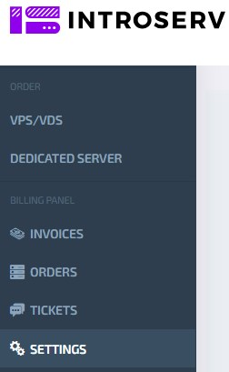

## **Invoices** 

- This section displays issued invoices and payment history.

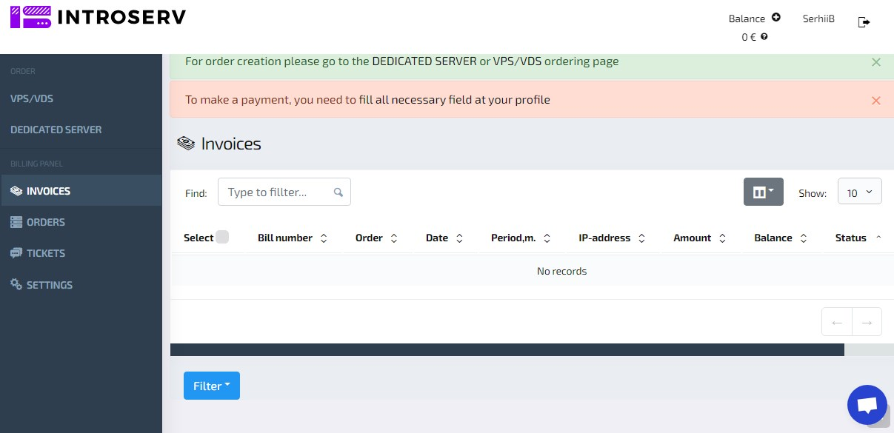

### Invoice Sorting

To sort invoices by their payment status, use the "Filter" button.

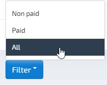 

The following filtering options are available:

- **Unpaid** — displays only invoices that have not yet been paid.
- **Paid** — displays only paid invoices.
- **All** — shows all invoices, regardless of payment status.

Selecting one of these options updates the list of invoices on the screen according to the chosen criterion, making it easier to navigate and find the necessary documents.

## **Orders**

-  In this section you can view your order history, status, and other information.

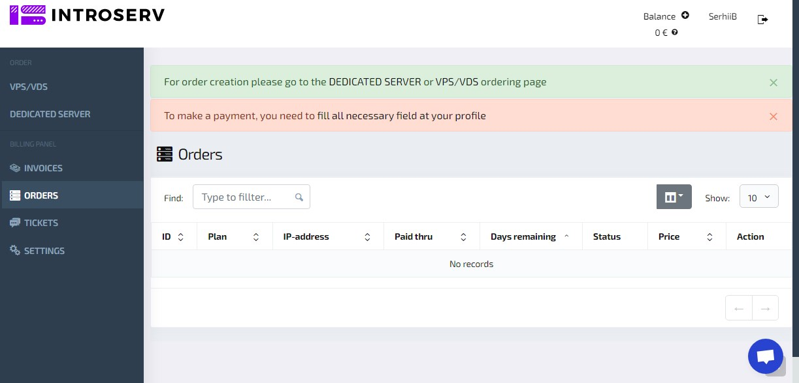

- **ID**: Unique identifier for the order
- **Plan**: The subscribed plan
- **IP Address**: The assigned IP address
- **Expires on**: The end date of the current billing period
- **Days Remaining**: Number of days until the end of the current billing period
- **Status**: Current order status (active, expired, etc.)
- **Cost**: Cost of the current plan. Или Price: More commonly used in everyday language
- **Actions**: Available options for the user (renew, cancel, upgrade, etc.

### How to Use the "Orders" Section

- **Searching for Orders:** Utilize the search field to quickly locate specific orders by ID, plan, or other parameters.
- **Sorting Orders:** Sort orders based on various criteria such as creation date, status, cost, and more.
- **Viewing Order Details:** Click on a specific order to view detailed information.
- **Managing Orders:** Depending on the order status, different actions will be available to you, such as renewal, plan changes, or cancellation.

### Placing a New Order

To place a new order, please click on the corresponding link (e.g., "[DEDICATED SERVER](https://introserv.com/products/dedicated-servers/)" or "[VPS/VDS](VPS/VDS)"). Follow the instructions on the order page, select the desired service plan, and complete all required fields.

### Payment for Services

 To pay for services, you need to fund your account balance. Payment options are available in the "[Invoices" section](http://docs-dev.introserv.com:3000/The%20billing%20menu#invoices). To make a payment, you need to complete all required fields in your profile. You cannot pay for services until you have completed the necessary information in your settings.

## **Balance**

To pay for services provided by IntroServ, the user’s internal account, referred to as the Balance, is used. The balance amount is displayed in the upper-right corner of the billing tool interface.

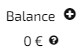

### Balance Top-up

1. The user selects the "Top-up internal balance" option. Press the button 

2. Specifies the desired top-up amount in any of the available currencies.

3. Clicks the "Proceed to invoice payment" button to complete the transaction.

   ###### *When adding funds in any of the available currencies, the amounts in the other currencies are automatically recalculated based on the current exchange rate. This allows the user to view the equivalent amount in other currencies according to the latest exchange rates.*

### Fund Deduction

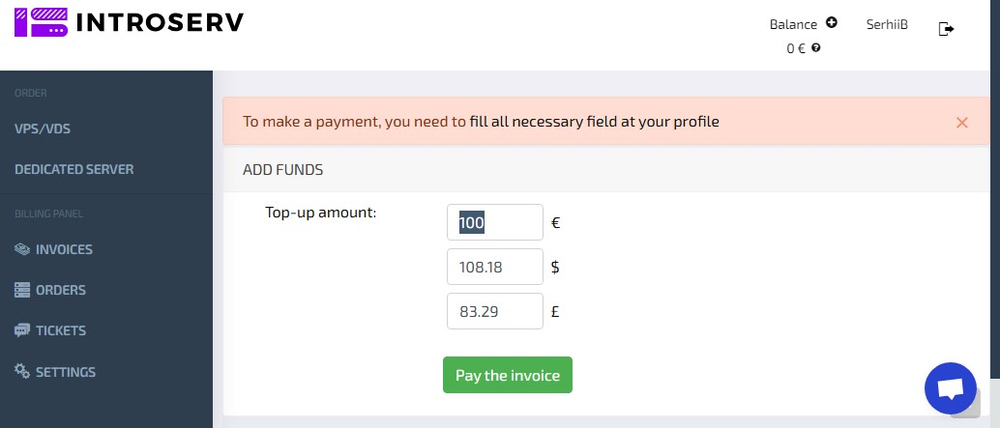

1. When ordering services with a cost that is equal to or less than the balance amount, the required amount is automatically deducted.
2. If the order amount exceeds the available balance, the user is prompted to add funds or choose an alternative payment method.

## **Tickets**

-  In the Tickets section, you can create and track support requests.

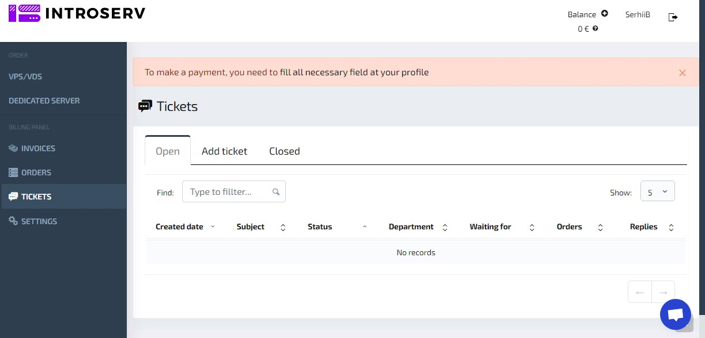

## **Settings**

 Here you can manage your personal information, and other settings. The Settings section allows you to manage your personal data, password, notifications, currency, interface language, and other parameters that affect your interaction with the [INTROSERV](https://my.introserv.com/) system.

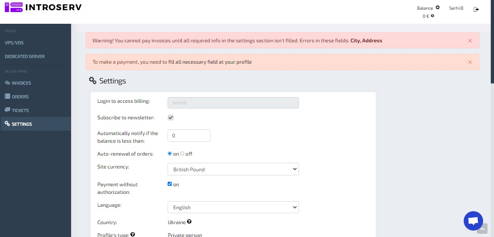

**Section Elements:**

###### Certain fields, such as last name, first name, email, city, and address, are mandatory. Payment cannot be processed without providing this information.

### Login to Your Billing Account

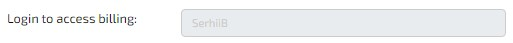

- **Description:** The unique username assigned to your account. For security reasons, this username cannot be changed.

### Newsletter Subscription 

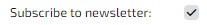

- **Description:** An option to subscribe to our company newsletter. By enabling this, you will receive regular updates, offers, and promotions to the specified email address.

### Low Balance Alert

- **Description:** Set a minimum balance threshold. The system will automatically send a notification when your balance falls below this set value.

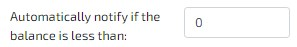

**Description:** Set a threshold below which the system will automatically send a notification if the user's balance falls.

### Auto-renewal of orders

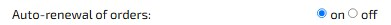

- **Options:**
  - **Enabled:** Services will be automatically renewed provided that there are sufficient funds in the balance.
  - **Disabled:** Services will not be automatically renewed. Manual renewal is required.
- **Description:** Allows you to configure automatic renewal for servers and other services.

### Site Currency

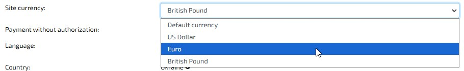

- **Description**: Select the currency in which prices will be displayed and payments will be processed on the website (e.g., euros).

### Payment without authorization

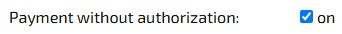

- **Description:** If enabled, users can make payments without re-authenticating

### Interface Language 

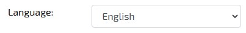

- **Description:** Select your preferred language for the user interface (e.g., English).

### Country 

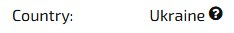

- - **Description:** The country where the user resides. Your chosen country may affect available payment methods and tax calculations. *To change your country, please create a ticket.*

    ### Profile Type

    

- **Options:**

  - **Private person**: Indicates that the account is registered to a private individual
  - **Company**: Specifies that the account is registered to a legal entity

- **Description:** The type of account (individual or company).

*Note: When choosing a profile, payment of bills may be blocked until the data is verified by our employees*

### Contact Information

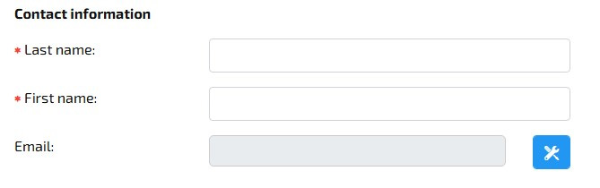

- Last Name: Required field for user's last name.
- First Name: Required field for user's first name.
- Email: Email address for communication and notifications.

To specify a new email address for communication and notifications, click the button. *Email verification status is also displayed here*.

### Mobile Number

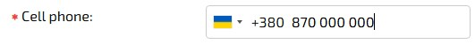

**Description:** Please enter your mobile number. We'll use this to verify your identity. Click "Verify" to continue.

### Call Password Verification

- **Description:** A verification method using a passcode delivered via a phone call. This provides an additional layer of security.
- *We will call the provided number. You do not need to answer the call. Please enter the last 4 digits of the number (digits only) in the field that appears after clicking "Confirm". If you only have a landline, please pick up the phone and listen for the 4 digits that will be spoken by the automated system. If the call does not go through, please use our second gateway where you need to pick up the phone and listen for the 4 digits that will be spoken by the automated system. If both methods fail, please create a support ticket.*

### Sending Email Messages

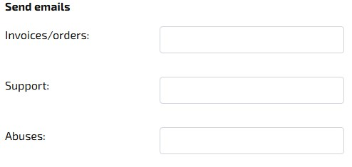

- **Accounts/Orders**: The email address where information about completed invoices and orders will be sent.
- **Technical Support**: The email address for communicating with the support service.
- **Abuses**: The email address for resolving issues.

### Security

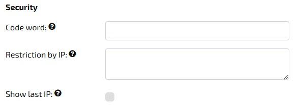

- **Code Word**: A field to enter a code word used to verify identity when contacting support or performing certain actions. It can only be specified once — after that, the field is no longer available for viewing or editing.

- **IP Restriction**: An option to restrict account access from specific IP addresses to protect the account from unauthorized access.

  *Every ip or ip range should start with a new line. IP range is specified using hyphens. If nothing is specified - there are no restrictions to access billing!*

  ***Example:***
  *192.15.3.2*
  *10.10.1.1*
  *192.168.0.1-192.168.0.10*

  ***Be careful!** If you specify IP addresses and do not specify your own IP address, you will not be able to access billing.* 

- **Billing Access Restriction by IP**: Each IP or IP range should be entered on a new line. Ranges are specified with a hyphen. If nothing is specified, there are no restrictions on billing access.

  - ***Example**: 192.15.3.2*
    *10.10.1.1*
    *192.168.0.1-192.168.0.10*

  ***Caution!** If you specify IP addresses and do not include your own IP, you will not be able to access billing.*

- **Display Last IP**: Enables the display of the last IP address used to log into the system.

### Password Change

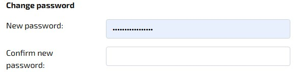

- **New Password:** Field for entering the new password for the account.
- **Confirm New Password:** Field for re-entering the new password to confirm it

### Postal Address

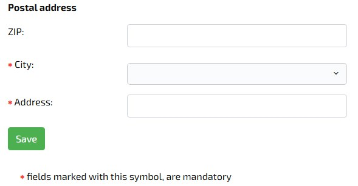

**Description**: Fields for entering the user's physical address. Completion of these fields is mandatory to enable payment processing. To save the settings entered, click the "Save" button at the bottom of the page.