# Кабінет користувача

## **Структура особистого кабінету**

Особистий кабінет Introserv (меню billing) надає користувачам зручний інструмент для керування своїми послугами. Тут ви можете відстежувати статус замовлень, оплачувати рахунки, змінювати налаштування та отримувати доступ до додаткових сервісів.

Особистий кабінет складається з таких основних розділів:

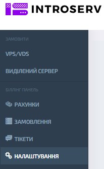

## **Рахунки**

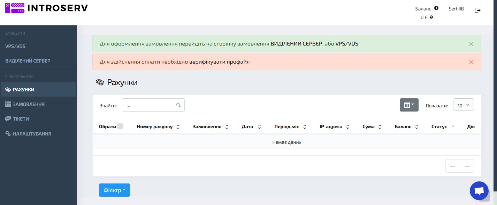

**Опис**: Тут ви можете переглянути всі виставлені рахунки та відстежити історію ваших платежів.

## **Замовлення**

У цьому розділі ви можете переглянути історію ваших замовлень

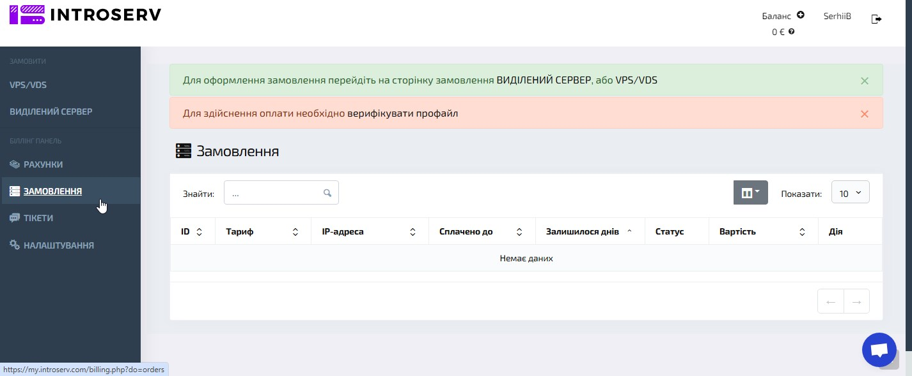

- **ID:** Унікальний номер замовлення (ідентифікатор).
- **Тариф:** Підключений тарифний план. Це тип послуги, яку ви обрали.
- **IP-адреса:** Присвоєна IP-адреса. Це унікальна адреса вашого підключення в мережі Інтернет.
- **Оплачено до:** Дата закінчення поточного платіжного періоду. До цієї дати послуга оплачена.
- **Залишилося днів:** Кількість днів, що залишилися до закінчення поточного платіжного періоду.
- **Статус:** Поточний статус замовлення (активний, прострочений тощо). Це відображає, чи активна ваша послуга.
- **Вартість:** Вартість поточного тарифного плану. Це сума, яку ви платите за послугу.
- **Дія:** Доступні дії для замовлення (продовжити, змінити тариф тощо). Це дії, які ви можете виконати зі своїм замовленням.

### Як користуватися розділом "Замовлення"

- #### **Пошук замовлення** 

  Використовуйте поле пошуку для швидкого знаходження потрібного замовлення за ID, тарифом або іншими параметрами.

- #### **Сортування замовлень** 

  Сортуйте замовлення за різними критеріями (дата створення, статус, вартість тощо).

- #### **Перегляд деталей замовлення** 

  Натисніть на потрібне замовлення для перегляду детальної інформації про нього.

- #### **Керування замовленням** 

  Залежно від статусу замовлення, вам будуть доступні різні дії (продовжити, змінити тариф, скасувати тощо).

### Оформлення нового замовлення

Для оформлення нового замовлення перейдіть за відповідним посиланням (наприклад, «[ВИДІЛЕНИЙ СЕРВЕР](https://introserv.com/ua/products/dedicated-servers/)» або «[VPS/VDS](VPS/VDS)»). Дотримуйтесь інструкцій на сторінці замовлення, оберіть необхідний тарифний план і заповніть всі обов’язкові поля.

### Оплата послуг

Щоб оплатити послуги, необхідно поповнити баланс вашого рахунку. Інструменти для оплати доступні в розділі «Рахунки». Для здійснення оплати необхідно заповнити всі обов'язкові поля у профілі. Ви не зможете оплачувати рахунки, доки не заповните необхідні дані в налаштуваннях.

## **Баланс** 

 Для оплати послуг, наданих компанією IntroServ використовується внутрішній обліковий запис користувача - **Баланс**. Сума коштів на балансі відображається в правому верхньому куті інтерфейсу білінг-інструмента.

### Поповнення балансу:

- Користувач обирає опцію "Поповнення внутрішнього балансу". Потрібно натиснути на 
- Вказує бажану суму поповнення в будь-якій з доступних валют.
- Натискає кнопку "Перейти до сплати рахунку" для здійснення платежу.

### Списання коштів:

- При оформленні замовлення на послуги, вартість яких відповідає або менша за суму на балансі, відбувається автоматичне списання необхідної суми.
- Якщо сума замовлення перевищує доступний баланс, користувачу пропонується додати кошти або обрати інший спосіб оплати.

## **Тікети**

У розділі «**Тікети**» ви можете створювати та відстежувати звернення до технічної підтримки.

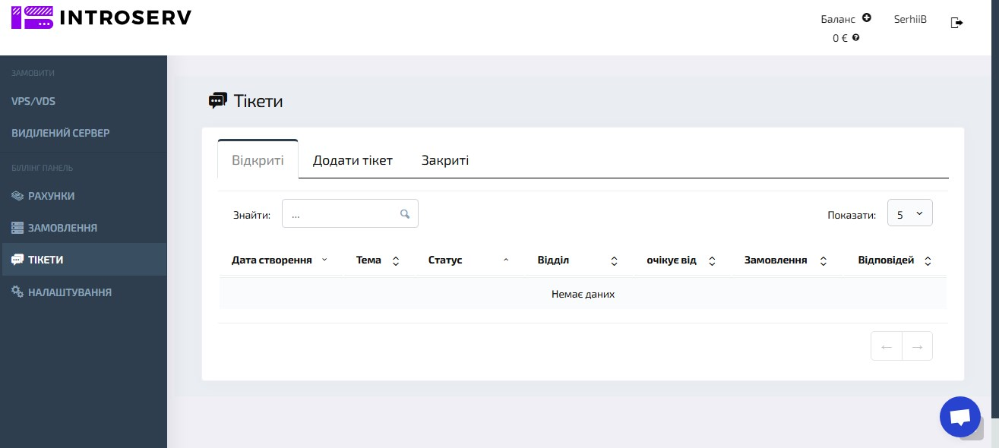

## **Налаштування**

У налаштуваннях ви можете змінювати свої персональні дані, пароль та інші параметри.

Розділ «**Налаштування**» призначений для керування особистими даними користувача, налаштуваннями сповіщень, валютою, мовою інтерфейсу та іншими параметрами, що впливають на взаємодію із системою INTROSERV.

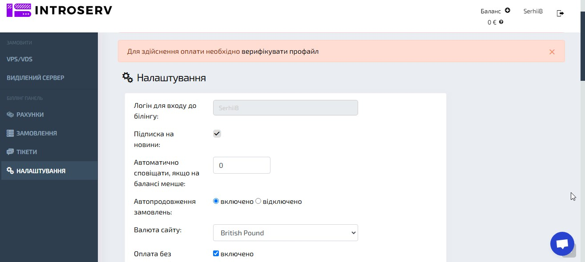

***Елементи розділу:**

*Деякі поля, такі як **прізвище**, **ім'я**, **email**, **місто**, **адреса**, є обов'язковими для заповнення. Без зазначення цих даних процес оплати неможливий.*

### Логін для входу в білінг

**Опис**: Ім'я користувача, яке використовується для доступу до білінгової панелі. Змінити неможливо.

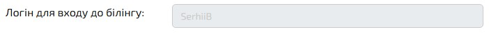

### Підписка на новини

**Опис**: Опція, що дозволяє підписатися на отримання новинних розсилок від компанії. Якщо ввімкнено, користувач отримуватиме оновлення та пропозиції на вказаний email.

### Автоматично сповіщати, якщо на балансі менше

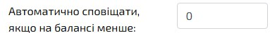

**Опис**: Тут можна вказати поріг, при якому система автоматично надішле сповіщення, якщо баланс користувача знизиться нижче заданого значення.

**Опції:**

- Увімкнено: Автоматичне подовження послуг за наявності достатнього балансу.
- Вимкнено: Послуги не подовжуватимуться автоматично, потрібно подовжувати вручну.

**Опис**: Дозволяє налаштувати автоматичне подовження серверів або інших послуг.

### Валюта сайту

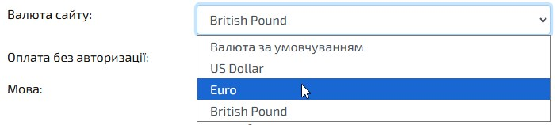

**Опції:** Тут обирається валюта для відображення цін та оплати на сайті (наприклад, євро).

**Опис:** Валюта, в якій будуть виставлятися рахунки та проводитися транзакції.

### Оплата без авторизації

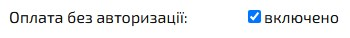

**Опис:** Якщо опція увімкнена, користувач може здійснювати оплату без необхідності повторної авторизації.

### Мова інтерфейсу

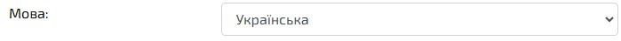

**Опис:** Тут можна вибрати мову для відображення інтерфейсу особистого кабінету (наприклад, *українська*).

### Країна

**Опис:** Країна проживання користувача. Вибір країни може впливати на доступні способи оплати та оподаткування.

**Якщо ви хочете змінити країну, будь ласка, створіть тiкет.*

### Тип профайлу

**Опис**: Тип облікового запису (приватна особа або компанія).

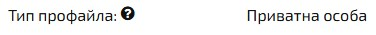

 **Опції:**

- **Приватна особа**: Вказує, що обліковий запис зареєстровано на фізичну особу.
- **Компанія**: Обліковий запис зареєстровано на юридичну особу.

**За вибору типу профілю оплата рахунків може бути заблокована до перевірки даних нашими співробітниками.*

### Контактна інформація

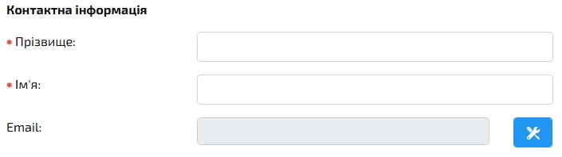

- **Прізвище**: Обов'язкове поле для введення прізвища користувача.
- **Ім'я**: Обов'язкове поле для введення імені користувача.
- **Email**: Адреса електронної пошти для зв'язку та отримання сповіщень.

Щоб вказати нову адресу електронної пошти для зв'язку та сповіщень, натисніть кнопку. 

Введіть новий E-mail.  На нього буде відправлений код активації. Тут також відображається статус підтвердження email.

### Мобільний телефон

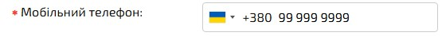

**Опис**: Поле для введення мобільного номера телефону. Потрібно для підтвердження особи через SMS або дзвінок. Після введення номера необхідно натиснути кнопку «Підтвердити» для верифікації.

### Підтвердження через Call Password

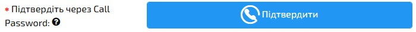

**Опис**: Функція верифікації через кодове слово під час дзвінка для підтвердження операцій. Передбачає використання додаткового заходу безпеки.

*Ми зателефонуємо на вказаний номер. Вам не потрібно відповідати на дзвінок. Напишіть у полі, яке з’явиться нижче після натискання кнопки «Підтвердити», останні 4 цифри номера (тільки цифри). Якщо у вас лише стаціонарний телефон, ви можете підняти трубку і прослухати 4 цифри, які продиктує робот.*

*Якщо дзвінок не проходить, скористайтеся нашим другим шлюзом, де потрібно підняти трубку і прослухати 4 цифри, які продиктує робот. Якщо обидва способи не працюють, будь ласка, створіть заявку в службу підтримки.*

### Відправка Email-повідомлень

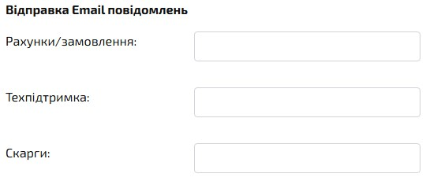

- **Рахунки/замовлення**: адреса електронної пошти, на яку буде надіслана інформація про виконані рахунки та замовлення.
- **Техпідтримка**: адреса електронної пошти для спілкування зі службою підтримки.
- **Скарги**: адреса електронної пошти для вирішення проблем.

### Безпека

**Опис**: налаштування, які підвищують рівень захисту облікового запису

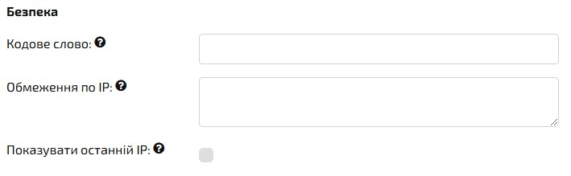

- **Кодове слово**: Поле для введення кодового слова, яке використовується для підтвердження особи під час звернення до служби підтримки або виконання певних дій. Його можна вказати лише один раз — після цього поле недоступне для перегляду та редагування.
- **Обмеження за IP**: Опція для обмеження доступу до облікового запису з певних IP-адрес, щоб захистити обліковий запис від несанкціонованого доступу.
- **Обмеження доступу до білінгу за IP**. Кожен IP або діапазон IP вказується в новому рядку. Діапазон IP вказується через дефіс. Якщо нічого не вказано — обмежень на доступ до білінгу немає! *Приклад*: 192.15.3.2 10.10.1.1 192.168.0.1-192.168.0.10

*Будьте обережні! Якщо ви вкажете IP-адреси і не додасте свій IP, ви не зможете потрапити до білінгу.*

- **Відображати останній IP**: Включає відображення останньої IP-адреси, з якої був виконаний вхід у систему.

### Зміна пароля

Налаштування дозволяють користувачеві оновити пароль для свого облікового запису.

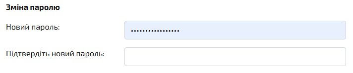

- **Новий пароль**: Поле для введення нового пароля для облікового запису.
- **Підтвердження нового пароля**: Поле для повторного введення нового пароля для його підтвердження

### Поштова адреса

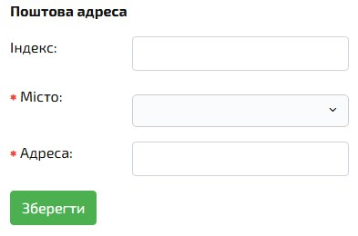

**Опис**: Поля для вказівки фізичної адреси користувача. Заповнення даних обов'язкове для можливості оплати.

Щоб зберегти дані, вказані в налаштуваннях, натисніть кнопку «Зберегти» внизу сторінки.