###### 

## **Структура личного кабинета**

Личный кабинет Introserv (billing-меню) предоставляет пользователям удобный инструмент для управления своими услугами. Здесь вы можете отслеживать статус заказов, оплачивать счета, изменять настройки и получать доступ к дополнительным сервисам.

Личный кабинет состоит из следующих основных разделов:

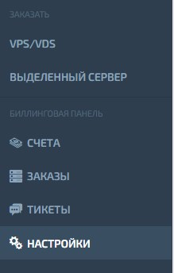

## **Счета**

В данном  разделе отображаются выставленные счета и показывается история платежей.

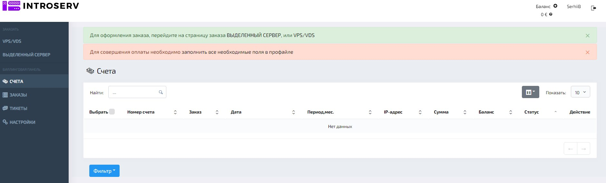

## **Заказы**

В этом разделе вы можете просмотреть историю ваших заказов, их статус и другую информацию.

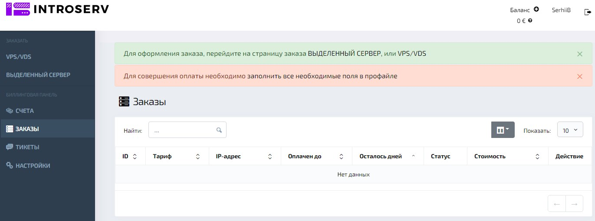

- **ID:** Уникальный номер заказа.
- **Тариф:** Подключенный тарифный план.
- **IP-адрес:** Присвоенный IP-адрес.
- **Оплачен до:** Дата окончания текущего платежного периода.
- **Осталось дней:** Количество дней до окончания текущего платежного периода.
- **Статус:** Текущий статус заказа (активен, просрочен и т.д.).
- **Стоимость:** Стоимость текущего тарифного плана.
- **Действие:** Доступные действия для заказа (продлить, изменить тариф и т.д.).

### Как пользоваться разделом "Заказы"

1. **Поиск заказа**: Используйте поле поиска для быстрого поиска нужного заказа по ID, тарифу или другим параметрам.

2. **Сортировка заказов:** Сортируйте заказы по различным критериям (дата создания, статус, стоимость и т.д.).

3. **Просмотр деталей заказа:** Кликните на нужный заказ для просмотра подробной информации о нем.

4. **Управление заказом:** В зависимости от статуса заказа, вам будут доступны различные действия (продлить, изменить тариф, отменить и т.д.).

   

### Оформление нового заказа

Для оформления нового заказа перейдите по соответствующей ссылке (например, "[ВЫДЕЛЕННЫЙ СЕРВЕР](https://introserv.com/ru/products/dedicated-servers/)" или "[VPS/VDS](VPS/VDS)"). Следуйте инструкциям на странице заказа, выберите необходимый тарифный план и заполните все требуемые поля.

### Оплата услуг

Для оплаты услуг необходимо пополнить баланс вашего счета. Инструменты по оплате доступны в разделе [Счета](http://178.132.3.34:3000/%D0%9B%D0%B8%D1%87%D0%BD%D1%8B%D0%B9%20%D0%BA%D0%B0%D0%B1%D0%B8%D0%BD%D0%B5%D1%82#%D1%81%D1%87%D0%B5%D1%82%D0%B0) . Для совершения оплаты необходимо [заполнить все необходимые поля в профайле](https://my.introserv.com/billing.php?do=settings) Вы не можете оплачивать счета, пока не заполните необходимые данные в **[настройках](http://docs-dev.introserv.com:3000/doc1#%D0%BD%D0%B0%D1%81%D1%82%D1%80%D0%BE%D0%B9%D0%BA%D0%B8)**.

## **Баланс**

Для оплаты услуг, предоставляемых компанией IntroServ, используется внутренний учетный счет пользователя — ***Баланс***. Сумма средств на балансе отображается в правом верхнем углу интерфейса биллингового инструмента.

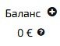

### Пополнение баланса:

- Пользователь выбирает опцию "Пополнение внутреннего баланса".  Для этого следует нажать на 

- Указывает желаемую сумму пополнения в любой из доступных валют.

- Нажимает кнопку "Перейти к оплате счета" для совершения платежа.

  ###### *При внесении средств в любой из доступных валют, сумма в остальных валютах автоматически пересчитывается по актуальному курсу. Это позволяет пользователю видеть эквивалентную сумму в других валютах на основе текущего курса обмена.*

  ###### 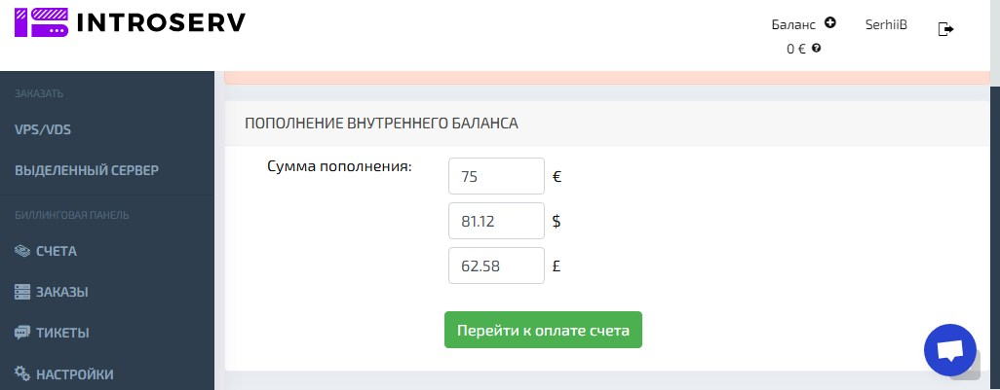

### Списание средств:

- При оформлении заказа на услуги, стоимость которых соответствует или меньше суммы на балансе, происходит автоматическое списание необходимой суммы.
- Если сумма заказа превышает доступный баланс, пользователю предлагается добавить средства или выбрать другой способ оплаты.

## **Тикеты**

В разделе **Тикеты** вы можете создавать и отслеживать обращения в техническую поддержку.

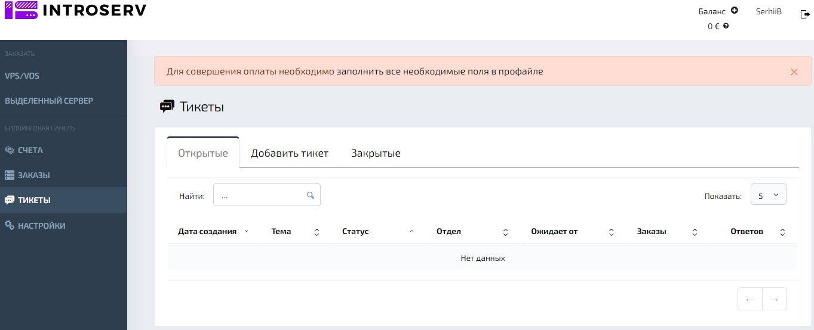

## **Настройки**

**Настройки:** В настройках вы можете изменить свои персональные данные, пароль и другие параметры.

- **Раздел "Настройки"**  предназначен для управления личными данными пользователя, настройками уведомлений, валютой, языком интерфейса и другими параметрами, влияющими на взаимодействие с системой INTROSERV.

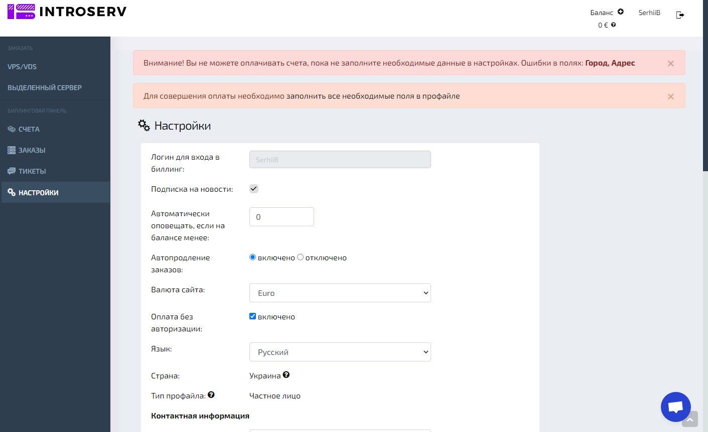

**Элементы раздела:**

###### *Некоторые поля, такие как **фамилия**, **имя**, **email**, **Город**, **Адрес** - являются обязательными для заполнения. Без указания этих данных процесс оплаты   невозможен.                                                                                                                                                                                                                                                                                         

### Логин для входа в биллинг

- **Описание:** Имя пользователя, используемое для доступа к биллинговой панели. Изменить невозможно.

### Подписка на новости

- **Описание:** Опция, которая позволяет подписаться на получение новостных рассылок от компании. Если включено, пользователь будет получать обновления и предложения на указанный email.

###  Автоматически оповещать, если на балансе менее

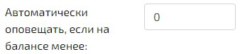

- **Описание:** Здесь можно указать порог, при котором система автоматически отправит уведомление, если баланс пользователя упадет ниже заданного значения.

###  Автопродление заказов

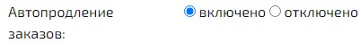

- Опции:
  - **Включено:** Автоматическое продление услуг при наличии достаточного баланса.
  - **Отключено:** Услуги не будут автоматически продлеваться, необходимо продлевать вручную.
- **Описание:** Позволяет настроить автоматическое продление серверов или других услуг.

###  Валюта сайта

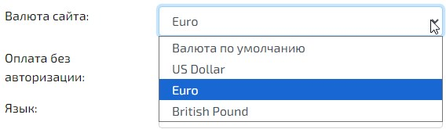

- **Опции:** Здесь выбирается валюта для отображения цен и оплаты на сайте (например, евро).
- **Описание:** Валюта, в которой будут выставляться счета и проводиться транзакции.

###  Оплата без авторизации

- **Описание:** Если опция включена, пользователь может совершать оплату без необходимости повторной авторизации.

###  Язык интерфейса

- **Описание:** Здесь можно выбрать язык для отображения интерфейса личного кабинета (например, русский).

###  Страна

- **Описание:** Страна проживания пользователя. Выбор страны может влиять на доступные способы оплаты и налогообложение.

  ###### *Если вы хотите изменить страну - создайте, пожалуйста, тикет

### Тип профайла

- Опции:

  - **Частное лицо:** Указывает, что учетная запись зарегистрирована на физическое лицо.
  - **Компания:** Учетная запись зарегистрирована на юридическое лицо.

- **Описание:** Тип учетной записи (частное лицо или компания).

  ###### *При выборе профайла оплата счетов может быть заблокирована до проверки данных нашими сотрудниками.

###  Контактная информация

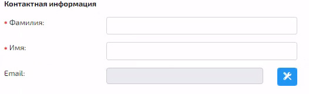

- **Фамилия:** *Обязательное* поле для ввода фамилии пользователя.

- **Имя:** *Обязательное* поле для ввода имени пользователя.

- **Email:** Адрес электронной почты для связи и уведомлений.

  Чтобы указать новый адрес электронной почты для связи и уведомлений, нажмите на кнопку. Статус подтверждения email также отображается здесь.

  

###  Мобильный телефон

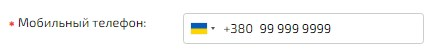

**Описание:** Поле для ввода мобильного номера телефона. Требуется для подтверждения личности через SMS или звонок. После ввода номера необходимо нажать кнопку **«Подтвердить»** для верификации.

###  Подтверждение через Call Password

- **Описание:** Функция верификации через кодовое слово при звонке для подтверждения операций. Подразумевает использование дополнительной меры безопасности. 

  ###### *Мы позвоним на указанный номер. Вам не нужно отвечать на звонок. Напишите в поле, которое появится ниже после нажатия кнопки "Подтвердить", последние 4 цифры номера (только цифры). Если у вас только стационарный телефон - можете поднять трубку и услышать 4 цифры, которые продиктует робот. Если звонок не проходит, то воспользуйтесь нашим вторым шлюзом, где вам нужно поднять трубку и услышать 4 цифры, которые продиктует робот. Если оба способа не работают - пожалуйста, создайте заявку в службу поддержки.

###  Отправка Email сообщений

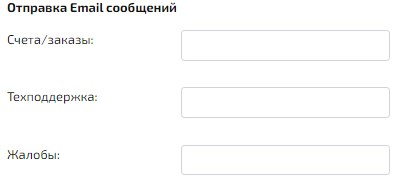

- Счета/заказы: адрес электронной почты, на который будет выслана информация о проведенных счетах и выполненных заказах
- Техподдержка: адрес электронной почты для общения со службой поддержки
- Жалобы:  адрес электронной почты для решения проблем

###### 

###  Безопасность

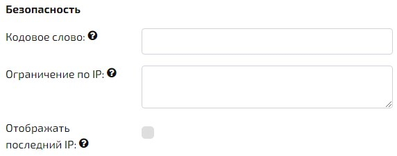

- **Кодовое слово:** Поле для ввода кодового слова, которое используется для подтверждения личности при обращении в службу поддержки или совершении определенных действий. Его можно указать только один раз - после этого поле не доступно для просмотра и редактирования.

- **Ограничение по IP:** Опция для ограничения доступа к аккаунту с определенных IP-адресов, чтобы защитить аккаунт от несанкционированного доступа.

  ###### Ограничение доступа к биллингу по IP. Каждый ip или диапазон ip указывается в новой строке. Диапазон ip указывается через дефис. Если ничего не указано - ограничений по доступу к биллингу нет!

  *Пример:*
  *192.15.3.2*
  *10.10.1.1*
  *192.168.0.1-192.168.0.10*

  ###### Будьте осторожны! Если Вы укажете IP-адреса и не укажете свой IP, то не сможете попасть в биллинг.

  

- **Отображать последний IP:** Включает отображение последнего IP-адреса, с которого был выполнен вход в систему.

###  Изменение пароля

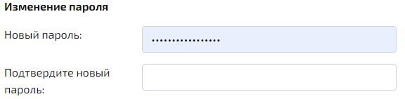

- **Новый пароль:** Поле для ввода нового пароля для аккаунта.
- **Подтверждение нового пароля:** Поле для повторного ввода нового пароля для его подтверждения.

###  Почтовый Адрес

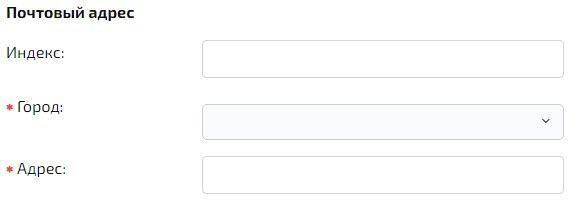

- **Описание:** Поля для указания физического адреса пользователя. Заполнение данных обязательно для возможности оплаты.

  

Чтобы сохранить данные, указанные в **настройках**, нажмите на кнопку **Сохранить** внизу страницы.
